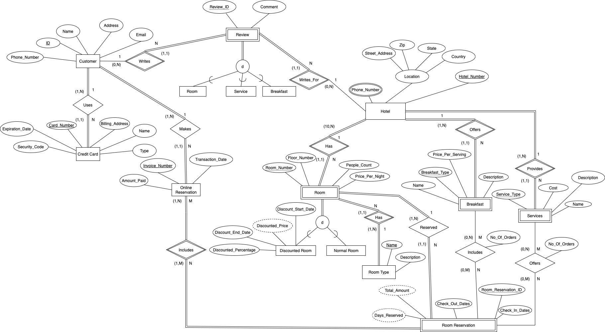

# Overview
This is the report for Team 1 for Project Delivery 1

### Teammates:
> **Course: CS 631, Section: 1J1 - Data Management System Design**

|member|email address|
|-|-|
|Susmita Biswas|sb78@njit.edu|
|Kranthi Gunuru|kg62@njit.edu|
|Shawn Cicoria|sc2443@njit.edu|

### Goals
The initial goal of this stage is to establish a basline Entity Relationsip model based upon the requirements initially provided. It's most likely going to change as further stages emerge and physical modeling starts.

While the first part of the requirements document articulates much of the Domain model needs, constraints, it is the Application Functional requirements that can also affect the model. As an example, the "Application Design section" states:

>The last application is crucial in decision making by the analysts and managers. For instance, it will allow the introduction of new room types, service types and breakfast types or modification of certain services, room and/or breakfast types, the suggestion of new offers to increase the profit of the hotels.

Given this statement, the entities for room types, service types, breakfast types are not restricted as simple multi-value attributes.

## Assumptions

1. Customer is using credit card only for online reservation,hence total participation in uses relationship and min-max is (1,N).
2. Not every customer writes reviews, hence partial participation of customer and min-max is (0,N).
3. A hotel can have zero reviews,thus partial participation in Writes_For relationship and min-max is (0,N).
4. Ratings cannot be 0 or less.
5. Credit Card number must be unique, since we have to have only one key per entity[as specified in the Project Deliverable1 requirements point#2(ii)].
6. Added a key for Room Reservation.

## Constraints

- booking for a room cannot overlap dates for same room for any other reservation - "not allow reservations for the same room with overlapping reservation periods".
- room discounts - "every year" - either 365 between or use calendar year.
- breakfast orders cannot exceed people count per room.
- system must ensure that customers can only write reviews for those rooms, breakfast types and service types they reserved.
- added a key Room_Reservation_ID for the entity Room Reservation.

## Challenges
- how are room rates changed over time; how does this affect discounts periods.
- an area that we are still thining on is linkage between reviews and what is being reviewed - rooms, service, breakfast. 

# Enhanced Entity Relationship Diagram (EERD)

# Enhanced Entity Relationship Diagram (EERD)

# Extracted Requirements
Utilizing a review of the requirements document and to provide succinct capture of requirements.

## Key requirements extracted from Requirements document
- hotel
    - hotel number (key identifier)
    - phone numbers (N) (many permitted)
    - location (1)
        - street address
        - country
        - state
        - zip
    
    - number of rooms ( rooms >= 10) **can use count(room)**

    - room (10:N)
        - room number (identifier at the hotel) - hotel number + room number => key
        - type of room
            -   single
            -   double
            -   deluxe
            -   suite
        - occupancy count
        - textual description (dependant upon type of room!)
        - floor number
        - price (per night)
        - room discount (0:N)
            - percent of normal price
            - start / end dates
            - year (requirement is 'only once per year' -- **TODO assumption either calendar year, or every 365 days?**)

    - breakfast (meals)
        - type + hotel (key identifier) - "a breakfast offered by hotel is identified by it's type"
            - continental
            - english
            - american
            - italian
            - french
        - price (per serving)
        - description

    - service
        - type + hotel (key identifier) - "a service provided by a hotel is identified by it's type"
            - parking
            - laundary
            - airport dropoff / pickup
        - cost

- customer
    - ID (number? alpha?)
    - name
    - address (1) (location can be a type? and we can re-use?)
        - street address
        - country
        - state
        - zip
        - phone number
    
- reservation
    - customer id
    - invoice number (key)
    - reservation date
    - amount paid
    - booking (1:N) - this allows multiple rooms per reservation - "at least one room reservation in one or different hotels for same/diff ... dates".
        - hotel + room
        - checkin date
        - checkout date
        - number of days (**this can be derived using = [checkout-date - check-in date]**)

    - payment (1)
        - credit card type - (visa|mastercard|discover|amex)
        - credit card name
        - credit card number
        - expiration date
        - security code
        - billing address (location can be a type? and we can re-use?)
            - street address
            - country
            - state
            - zip
            - phone number

    - breakfast included (0:N)
        - breakfast + type (0:N) (hotel + type)
        - orders (0: room person count) - via "booking" within reservation
            - breakfast + type
        - number of orders (**derivable via count(orders)**)
        - **cost? derivable but does not allow change over time**

    - service booking (0:N) - "**may also contain** one or more services; a room reservation can contain one or more service types"
        - type + hotel (the key of service)

    - reservation cost (derivable)
        - breakfast included -> hotel:breakfast:type.cost
        - service booking -> hotel:service.cost

- review
    - review id
    - customer id - **potentially derive via reservation**
    - hotel id - **this and customer id + category** should be the "uniquness" needed. this would allow a customer only 1 review at time for the hotel + category
    - ~~reservation id~~ - **review for which they made a reservation - not to be used**
        - booking specific???
    - category: must be the following
        - room review **only for a room and hotel:room:number**
        - service review - **only for 1 customer and hotel:service:type**
        - breakfast review - **only for 1 customer and hotel:breakfast:type**
    - rating: `numeric 0 < r <= 10`
    **key on customer id + category** - as customer can write a review for each category

## Notes
